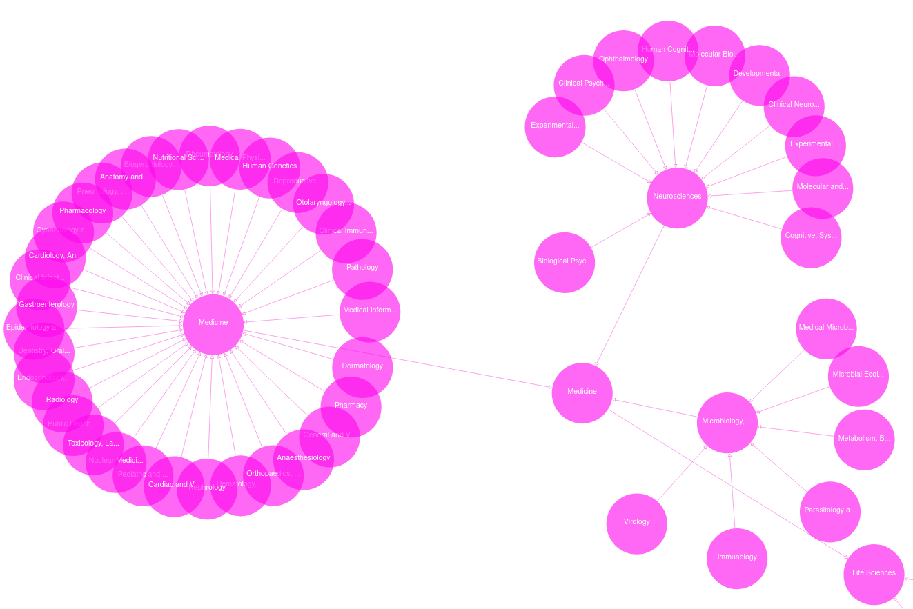

# DFG Fachsystematik Ontology / DFG Classification of Subject Areas Ontology

[DFG](https://www.dfg.de/en) (The Deutsche Forschungsgemeinschaft - German Research Foundation) *Classification of Scientific Disciplines, Research Areas, Review Boards and Subject Areas* is published as a PDF or HTML (see links below). 

We decided to build upon this work and build and RDF based ontology, for the *DFG Classification of Subject Areas*, so that browsing, searching and mapping (of subject number and its label) could be easy achieved by ontology/RDF processing software, such as ontology-lookup systems and tripe-stores.

## Ontology

* **Ontology TTL**: [dfgfo.ttl](./dfgfo.ttl)
* **Ontology IRI**: <https://github.com/tibonto/dfgfo/>
* **Ontology PURL**: <https://raw.githubusercontent.com/tibonto/DFG-Fachsystematik-Ontology/main/dfgfo.ttl>
* **ontology prefix/id**: `dfgfo`

## Create/update ontology

**[dfgfo.ttl](./dfgfo.ttl) ontology file is created, by [scripts/create_ontology.py](./scripts/create_ontology.py) python script**, which

* parses the DFG classification system encoded in csv/Fachsystematik_20XX-20XX.csv (in EN/DE) (cf. directory [csv/](/csv/) and [csv/README.md](/csv/README.md))
* encodes each of the DFG's classification subjects (in .csv cells) into RDF graph triples
  * of type `owl:Class`
  * with `rdfs:label` in EN and skos:altLabel in DE
  * subsumed to parent subject with `rdfs:subClassOf` accordinng to DFG Classification hierarchy
* parses the metadata triples from [metadata.ttl](./metadata.ttl) into a graph
* joins metadata and DFG classification graphs into [dfgfo.ttl](./dfgfo.ttl)

### Run

Create a python3 Virtual Environment

Install requirements `pip install -r scripts/requirements.txt`

Run script to create ontology `python scripts/create_ontology.py`. Make sure to use end of line sequence `LF` for  [/csv/Fachsystematik_2020-2024.csv](/csv/Fachsystematik_2020-2024.csv).

## Other scripts

* [scripts/parse_csv.py](./scripts/parse_csv.py) parses the CSV and ensures that the columns `Subject Number` and `Fachnummer` have the same values

## Ontology contributions

Contributions are welcome.

At every push or pull_request a [ROBOT report](http://robot.obolibrary.org/report) and  [ROBOT validate OWL DL profile](http://robot.obolibrary.org/validate-profile) test will be run from [.github/workflows/main.yml](.github/workflows/main.yml).

## DFG Classification of Scientific Disciplines 

* [HTML page](https://www.dfg.de/en/research-funding/proposal-funding-process/interdisciplinarity/subject-area-structure)
* PDFs
  * 2020-2024
    * [PDF(en)](https://www.dfg.de/download/pdf/dfg_im_profil/gremien/fachkollegien/amtsperiode_2020_2024/fachsystematik_2020-2024_en_grafik.pdf)
    * [PDF(de)](https://www.dfg.de/download/pdf/dfg_im_profil/gremien/fachkollegien/amtsperiode_2020_2024/fachsystematik_2020-2024_de_grafik.pdf)
  * 2024-2028
    * [PDF(en)](https://www.dfg.de/resource/blob/331950/85717c3edb9ea8bd453d5110849865d3/fachsystematik-2024-2028-en-data.pdf)
    * [PDF(de)](https://www.dfg.de/resource/blob/331944/33422f091e941592cdc355038a865e03/fachsystematik-2024-2028-de-data.pdf)
* Edited CSV - combining both German and English labels
  * [2020-2024](/csv/2020-2024/Fachsystematik_2020-2024.csv) (this repo)
  * [2024-2028](/csv/2024-2028/Fachsystematik_2024-2028.csv) (this repo)

## Releases:

For previous versions (2020-2024) see [[https://github.com/tibonto/DFG-Fachsystematik-Ontology/releases]]